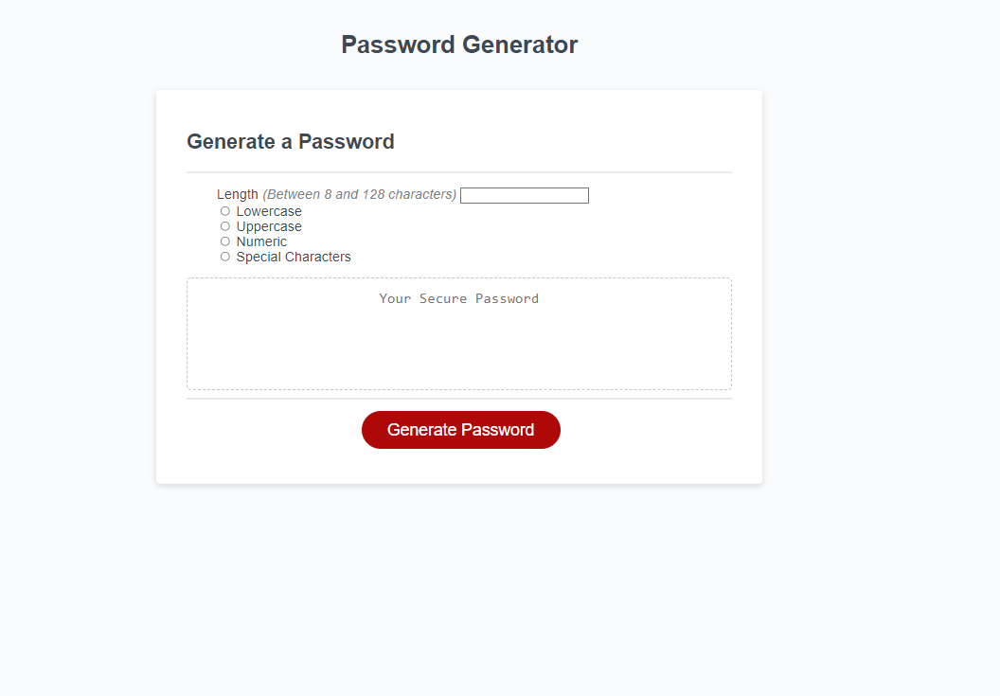

# uclaext-week3-challenge

Password Generator Challenge

The website allows users to generate their very own password that is between 8 and 128 characters in length. 
Users can select if they would like lowercase, uppercase letters, numbers, and/or special characters. 

Warning:
If a valid length is not inputted or if there is no selection of the type of characters, an error will appear. 

S/O to UCLA Extension for providing the basic HTML and CSS layout.

Link to website: 

